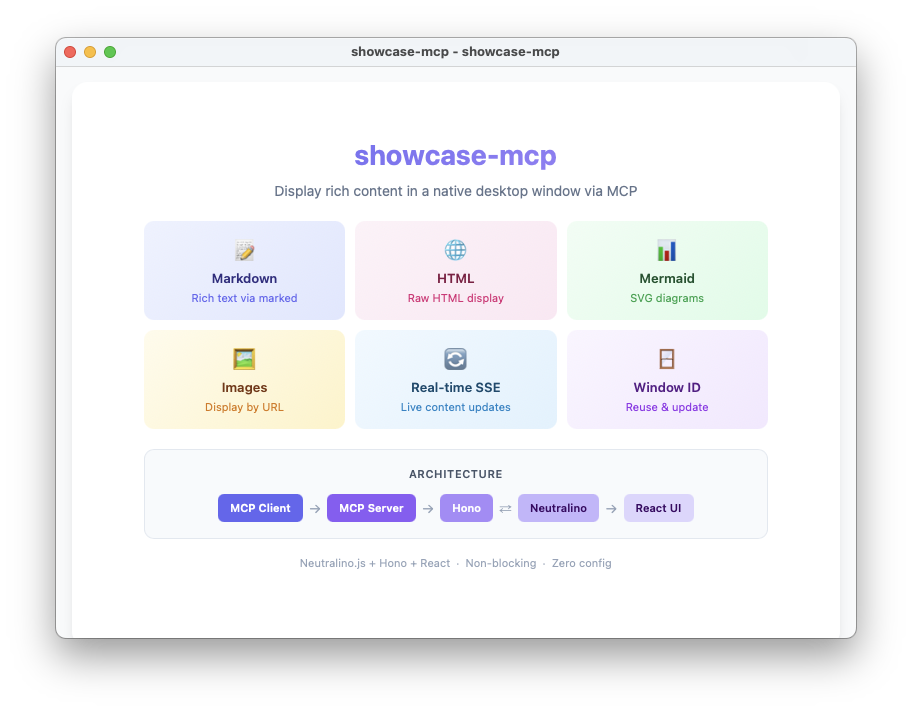

# showcase-mcp

An MCP server that displays rich content (Markdown, HTML, Mermaid diagrams, images) in a native desktop window.

When an MCP client like Claude Code calls the `show` tool, a Neutralino.js-based window opens and renders content in real time via SSE.



## Features

- Markdown — Rendered via `marked`
- HTML — Raw HTML display
- Mermaid — SVG diagram rendering
- Images — Display by URL
- Window ID management — Update existing windows by ID, or open new ones
- Real-time updates via SSE — Content is pushed to the window without reopening
- Non-blocking — Tool calls return immediately

## Requirements

- Node.js >= 20
- pnpm

## Setup

```bash
pnpm install

# Download Neutralino binary
pnpm run setup

# Build React bundle + Tailwind CSS
pnpm run build:assets

# Compile TypeScript
pnpm run build:ts
```

## Usage

### With Claude Code

Add the following to your `.mcp.json`:

```json
{
  "mcpServers": {
    "showcase-mcp": {
      "type": "stdio",
      "command": "npx",
      "args": ["tsx", "<path-to>/showcase-mcp/src/index.ts"]
    }
  }
}
```

Then call the `show` tool from Claude Code to open a window.

### Development

```bash
pnpm dev
```

## `show` Tool

### Parameters

| Parameter  | Type      | Description                                         |
| ---------- | --------- | --------------------------------------------------- |
| `title`    | `string`  | Title displayed at the top of the window (required) |
| `message`  | `string?` | Markdown-formatted text                             |
| `html`     | `string?` | Raw HTML content                                    |
| `mermaid`  | `string?` | Mermaid diagram source code                         |
| `imageUrl` | `string?` | URL of an image to display                          |
| `windowId` | `string?` | Window ID to update. Omit to open a new window.     |

### Response

```json
{ "windowId": "xxxxxxxx-xxxx-xxxx-xxxx-xxxxxxxxxxxx" }
```

### Behavior

| `windowId`                        | Action                                                              |
| --------------------------------- | ------------------------------------------------------------------- |
| Omitted                           | Opens a new window. Returns a new `windowId`.                       |
| Valid (window is open)            | Updates the existing window's content. Returns the same `windowId`. |
| Invalid (window closed / unknown) | Opens a new window. Returns a new `windowId`.                       |

## Architecture

```
MCP Client (stdio) → MCP Server → Hono HTTP Server (port=0) → Neutralino Window
                                         ↕ SSE
                                    React UI (App.tsx)
```

1. MCP client calls `show`
2. Hono HTTP server starts on a random port and a Neutralino window opens
3. React UI connects via SSE (`/events`) and renders content
4. Subsequent calls with the same `windowId` update content through SSE
5. Calls without `windowId` always open a new window
6. Closing a window cleans up its HTTP server
